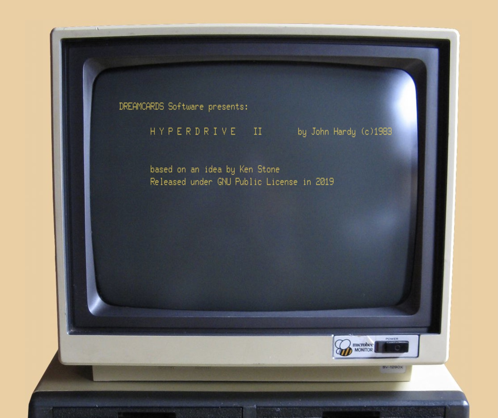

# Hyperdrive II: The Microbee Adventure

## A Microbee Original

Hyperdrive II is a Microbee science-fiction text adventure written by John
Hardy in 1982 and released in 1983. The BASIC listing's title screen credits
Hardy and notes it is "based on an idea by Ken Stone," which ties it directly
to the small circle of early-1980s collaborators who built Caverns and the
original Hyperdrive.

That credit matters. Hyperdrive II can be read as a sequel in spirit to Ken
Stone's VIC-20 Hyperdrive, carrying forward the core idea of a lone pilot drawn
into a vast, abandoned ship. But the execution is new: a Microbee-only adventure
with its own map, puzzles, and voice, built on the BASIC engine that powered
Caverns.

## The Premise (From the Intro)

The intro opens with a title card and a small burst of sound, then switches to
high-resolution graphics and a starship profile. You are the lone pilot of a
scout craft: a T Class ship registered as T8159417-1, named Hopscotch, driven by
Davies Warp, and built as a GMH Sunblazer XZL. You are returning from a mapping
mission in the Garth Beta system when your long-range scanners pick up a large
stationary object in your path.

At first it reads like a moon, but it resolves into a vast, deserted spaceliner
from an early era of hyperdrive technology. As you try to avoid it, you realize
its tractor beam is still alive. The ship draws you in, jams your radio, and
pulls you toward its open docking bay. You are trapped, and the only way out is
through the ship itself.

## What the Game Feels Like (No Spoilers)

Hyperdrive II is classic text adventure: short commands, careful mapping, and a
constant sense of risk. The ship is immense and layered. You move through
corridors and junctions, past crew quarters and observation decks, into labs,
control rooms, and a central computer complex. The environment is physical and
hazardous: sealed airlocks, zero-gravity sections, a minefield, and a chasm
spanned by an electronic bridge. There is a teleport room, a reactor control
space, and a power station whose status governs everything else.

The ship is not empty. Patrol robots still move in the background. Alien slugs
have carved out their own presence, and there are hints of a broader ecology
woven into the rooms and the ship's logs. The library holds magnetic disks that
expand the lore in dry, official language: operational reports, species data,
and the bureaucratic texture of a ship that once lived at full capacity.

The game expects practical thinking. You will come across utilitarian equipment
like an oxygen mask, magnetic shoes, a torch, tools, and data disks. It rewards
observation and patience and occasionally teases you for being reckless. The
parser is direct and sometimes blunt, but it offers enough vocabulary to let
you experiment and learn the ship's rules.

## The Recovery Story

Hyperdrive II resurfaced on the B side of a cassette that otherwise contained
Caverns for the 16K Microbee. That tape survived in hobbyist collections and
was preserved through the Microbee Software Preservation Project. Alan
Laughton (aka ChickenMan) was critical in compiling the preservation media and
helping recover the original program text. His guidance and generosity made it
possible to reconstruct the listing and restore the game to readable form.

In 2019, the preserved files were re-shared and the tokenized Microbee BASIC
files were made available for conversion. In 2021, the Dreamcards DUO 3 tape
was recorded, and the intro programs that framed the story and rules were
recovered alongside scans of the tape insert. Those pieces complete the
presentation layer that originally loaded the main game.

This repository exists to keep that recovery intact and to make sure Hyperdrive
II is documented as its own Microbee title, distinct from the older VIC-20
game.

## Origins and Lineage

Caverns began life on the Sinclair ZX81, moved to the VIC-20, and ultimately
found its most mature form on the Microbee. Hyperdrive II is a sibling to that
Microbee version: a science-fiction adventure built with the same engine, but
with a different setting, different puzzles, and a sharper sense of scope.

In 1983 the Dreamcards company distributed Caverns as part of a "DUO" pack,
bundled alongside Hyperdrive II. That pairing links the two games in history,
but not in identity. Hyperdrive II is John Hardy's Microbee work, while the
original Hyperdrive on VIC-20 was Ken Stone's game based on the earlier
Caverns lineage.

## A Different Game, A Different Machine

Because the name overlaps, it helps to be explicit: Hyperdrive II is not the
VIC-20 game called Hyperdrive. It is a separate Microbee title within the
Hyperdrive tradition, drawing on Ken Stone's original idea while standing as a
distinct game with its own design and tone.

## Contemporary Catalogue and Tape Copy

The surviving tape insert and catalogue text add period detail to Hyperdrive
II's story.

The DUO 3 cassette insert labels the bundle as "Caverns & Hyperdrive - J. Hardy"
and calls it "Two great Microbee adventures (16k)." The cover copy describes
both games as "two superb adventures" and invites players to first uncover the
force holding a ship frozen in space, then "swap sides" and hunt for hidden
jewels. It closes with a confident sales line about value for money.

A Dreamcards catalogue entry describes "Duo 3 ("Hyperdrive" and "Caverns" by
John Hardy)" and frames Hyperdrive as an adventure aboard a strange alien
spacecraft, with the player's ship drawn in by a long-range tractor beam. It
highlights the mystery of a deserted craft, contrasts Caverns as a traditional
fantasy adventure, and notes that the package suits 16K or 32K Microbee systems
with a listed price of $19.95.

A Talking Electronics advertisement (Issue 10) promoted Hyperdrive II (16k)
under the "Brainfood for your Microbee" banner. Its blurb matches the in-game
premise: your tiny space craft is drawn by a tractor beam to the docking bay of
an enormous space liner, leaving you to discover why it is deserted and how to
escape. The ad lists BeeHive Software House as the seller and advertises
cassette prices at $12.00 each.

## What You Will Find Here

This project mirrors the layout of the Hyperdrive repository so the two can be
understood side by side, while still staying clearly distinct.

Primary artifacts:

- `src/hypedrive2.bas`: recovered BASIC source listing
- `src/hypedrive2.mwb`: tokenized Microbee BASIC version
- `src/hyperdrive2-intro.bas`: title and story intro loader
- `src/hyperdrive2-intro.mwb`: tokenized intro program
- `src/protected/`: protected or obfuscated variants (if present)

Supporting material and notes:

- [docs/recovery-notes.md](docs/recovery-notes.md): narrative of the recovery
- [docs/peek-poke-notes.md](docs/peek-poke-notes.md): Microbee hardware notes
- `recovery/`: scripts and intermediate outputs used during reconstruction
- `assets/`: scans and ads that document the era
- `assets/hyperdrive2.mp3`: reconstructed victory tune audio

## Archival Images

Caption: DUO 3 tape insert for "Caverns & Hyperdrive - J. Hardy" and "Two great
Microbee adventures (16k)."

Caption: Dreamcards catalogue entry describing DUO 3 and its 16K/32K system
requirements and price.

Caption: Talking Electronics Issue 10 advertisement listing Hyperdrive II (16k)
and its premise under the BeeHive Software House banner.
